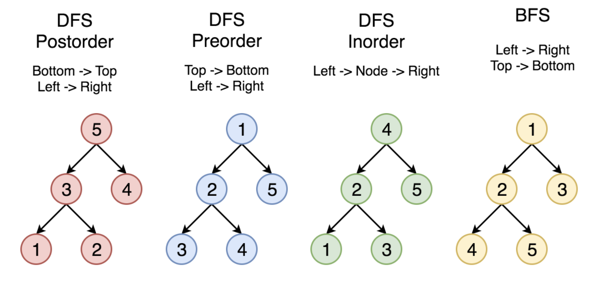

## Tree traversal

#### Pre-order
Pre-order traversal is to visit the root first. Then traverse the left subtree. Finally, traverse the right subtree. Here is an example:

**Note:** in the following animation, the **highlighting** in red indicates that we return from the visit of the node. The order of the visit is indicated on the array right below the binary tree.

#### In-order
In-order traversal is to traverse the left subtree first. Then visit the root. Finally, traverse the right subtree. Typically, for `binary search tree`, we can retrieve all the data in sorted order using in-order traversal.

#### Post-order
Post-order traversal is to traverse the left subtree first. Then traverse the right subtree. Finally, visit the root.
It is worth noting that when you delete nodes in a tree, deletion process will be in post-order. That is to say, when you delete a node, you will delete its left child and its right child before you delete the node itself.

Also, post-order is widely use in mathematical expression. It is easier to write a program to parse a post-order expression. Here is an example:

You can easily figure out the original expression using the inorder traversal. However, it is not easy for a program to handle this expression since you have to check the priorities of operations.

If you handle this tree in postorder, you can easily handle the expression using a stack. Each time when you meet a operator, you can just pop 2 elements from the stack, calculate the result and push the result back into the stack.

